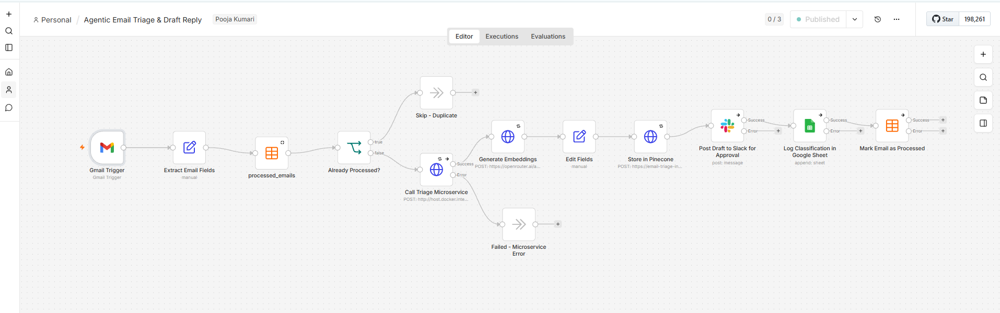
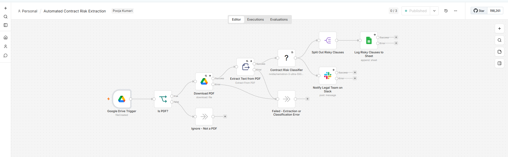
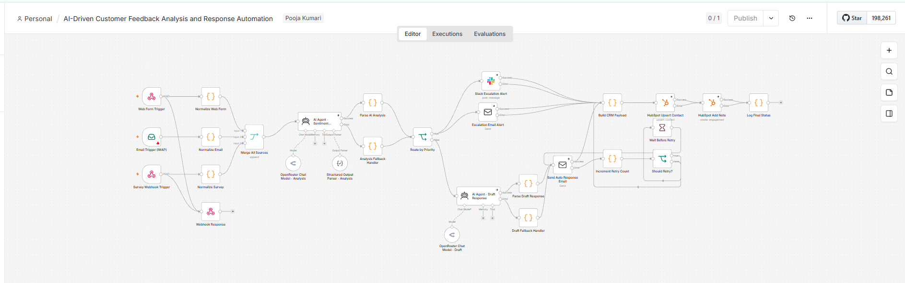
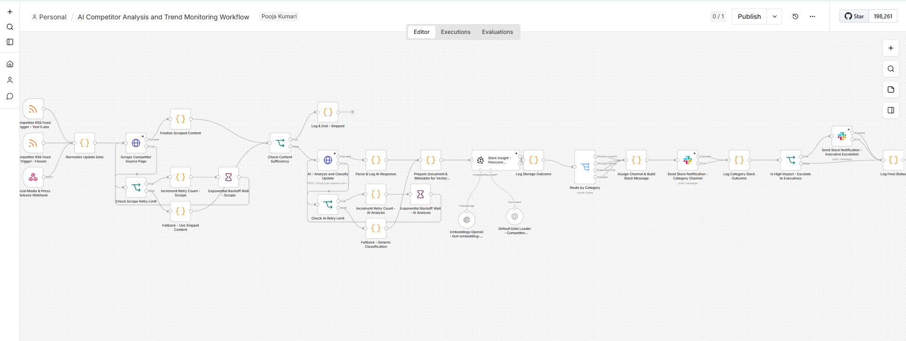
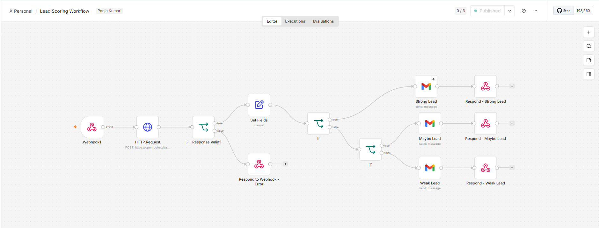
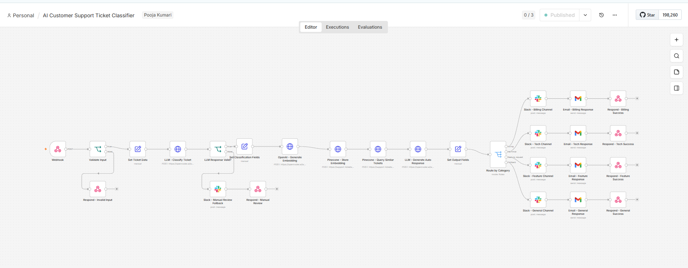
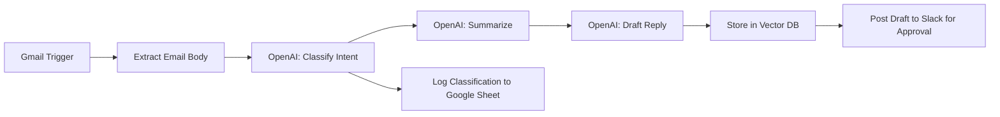
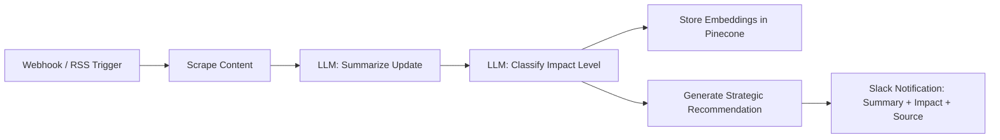

# n8n Automation Workflows

A collection of practical, real-world automation workflows built with n8n, covering AI agents, content generation, lead management, customer support, and market intelligence use cases.

Each workflow is provided as an importable `.json` file. Download the file and import it directly into the n8n editor to get started.

---

## Table of Contents

- [What is n8n?](#what-is-n8n)
- [Prerequisites](#prerequisites)
- [Workflows Included](#workflows-included)
- [Workflow Screenshots](#workflow-screenshots)
- [Architecture Overview](#architecture-overview)
- [How to Use a Workflow](#how-to-use-a-workflow)
- [Tech and Concepts Used](#tech-and-concepts-used)
- [Limitations and Known Issues](#limitations-and-known-issues)
- [Who Is This For](#who-is-this-for)
- [Contributing](#contributing)
- [License](#license)
- [Author](#author)

---

## What is n8n?

[n8n](https://n8n.io/) is an open-source workflow automation tool that connects apps, APIs, and services with minimal code. It combines a visual, node-based editor with the flexibility to extend workflows using custom logic when needed.

---

## Prerequisites

Before importing any workflow from this repository, make sure the following are in place:

- **n8n instance**: self-hosted (v1.x recommended) or n8n Cloud
- **API credentials** for the services each workflow uses, configured as n8n Credentials (never hardcoded in the JSON):
  - OpenAI API key
  - Pinecone API key and index (for RAG, competitor analysis, feedback analysis, and support ticket workflows)
  - Google Sheets / Google Drive OAuth (for logging and storage)
  - Slack OAuth token or webhook (for notifications and approvals)
  - Gmail OAuth (for email-triggered workflows)
  - Twitter/X and LinkedIn credentials (for the content curation and posting pipeline)
- **Community nodes**, if required by a specific workflow, installed via n8n's community node manager

Credential names referenced inside each workflow may need to be re-mapped after import, since n8n does not export actual credential values for security reasons.

---

## Workflows Included

| File | Type | Description |
| --- | --- | --- |
| `Agentic Email Triage & Draft Reply.json` | AI Agent | Monitors a Gmail inbox for new messages, classifies intent (inquiry, support, spam) using OpenAI, generates a summary, and drafts a reply. Stores the original message and draft in a vector store for context retrieval, posts the draft to Slack for human approval, and logs the classification in a Google Sheet. |
| `Automated Contract Risk Extraction.json` | AI Agent | Ingests a contract PDF, extracts the text, and uses OpenAI to identify high-risk clauses and summarize key obligations. Saves results to a Google Sheet and notifies the legal team via Slack through a custom node built to return structured clause classifications. |
| `AI-Driven Customer Feedback Analysis and Response Automation.json` | Automation | Collects customer feedback from email, web forms, and surveys, then uses AI to categorize sentiment, extract key themes, and draft personalized responses. Routes high-priority negative feedback to a human escalation channel while automatically sending responses to lower-priority items, and updates CRM records accordingly. Includes retry handling for failed deliveries. |
| `AI Content Curation and Social Posting Pipeline.json` | Automation | Monitors RSS feeds, news APIs, and social media trends to identify relevant industry content. Uses AI to filter for relevance, extract key points, and generate summaries, then schedules posts to LinkedIn and Twitter with appropriate hashtags. Uses a RAG component backed by Pinecone to maintain brand voice consistency with past posts. |
| `AI Competitor Analysis and Trend Monitoring.json` | AI Agent | Monitors competitor websites, social media, and press releases for product launches, pricing changes, and other market-moving updates. Summarizes and classifies each update by impact level, stores insights in a Pinecone vector store, and sends a structured Slack notification with a summary, impact level, source link, and a brief strategic recommendation. |
| `Lead Scoring Workflow.json` | Automation | Qualifies incoming leads from a webhook trigger by scoring submitted data (name, company, message) from 1 to 10 using an LLM, based on criteria such as budget mentions, decision-maker language, and fit keywords. Outputs the score with a short reasoning summary and stores results locally or sends them by email. Includes error handling for API failures. |
| `AI Customer Support Ticket Classifier.json` | AI Agent | Classifies incoming support tickets from a webhook trigger by sentiment, urgency, and category using OpenAI. Stores ticket embeddings in Pinecone for similarity search, routes tickets to the appropriate Slack channel or email group, and generates a contextual auto-response referencing similar past tickets. Includes a fallback path for manual review. |
| `Final Rag Agent.json` | AI Agent | A complete RAG (Retrieval-Augmented Generation) agent that retrieves relevant context before answering queries. |
| `Rag Agent Part 1.json` | AI Agent | First stage of a multi-step RAG pipeline, handling data ingestion and chunking. |
| `News Agent.json` | Automation | Fetches, filters, and summarizes news from multiple sources. |
| `Redit News Agent.json` | Automation | Monitors Reddit for trending topics and surfaces relevant posts. |
| `Prompt-to-Action Assistant_.json` | AI Agent | Takes a user prompt and determines and executes the appropriate action. |
| `InstagramLeadGenerator.docx` | Guide | Documentation for an Instagram lead generation automation workflow. |
| `Recipe GeneratorN8N Workflow.docx` | Guide | Documentation for an AI-powered recipe generation workflow. |

---

## Workflow Screenshots

Canvas view of each workflow as built in n8n.

**Agentic Email Triage & Draft Reply**

**Automated Contract Risk Extraction**

**AI-Driven Customer Feedback Analysis and Response Automation**

**AI Competitor Analysis and Trend Monitoring**

**Lead Scoring Workflow**

**AI Customer Support Ticket Classifier**

---

## Architecture Overview

High-level flow for two of the more complex workflows in this repository.

**Agentic Email Triage & Draft Reply**

**AI Competitor Analysis and Trend Monitoring**

---

## How to Use a Workflow

1. Open the n8n editor (cloud or self-hosted).
2. Select **Import from File**.
3. Choose the desired `.json` workflow file from this repository.
4. Configure the required API keys and credentials within n8n (credentials are never included in the exported JSON).
5. Execute the workflow to verify it runs as expected.

---

## Tech and Concepts Used

- **n8n** — Workflow automation engine
- **REST APIs** — Integration with external services
- **Webhooks** — Event-driven workflow triggers
- **AI / LLM Nodes** — OpenAI and related integrations
- **RAG (Retrieval-Augmented Generation)** — Context retrieval prior to AI response generation
- **Pinecone** — Vector storage for embeddings and similarity search
- **JSON** — Workflow export and import format

---

## Limitations and Known Issues

- Workflows depend on third-party API rate limits (OpenAI, Pinecone, Slack, social platforms); high-volume use may require backoff tuning beyond what is configured.
- LLM-generated classifications, scores, and draft replies are probabilistic and should be reviewed before fully automated use in production, particularly for customer-facing responses.
- Credentials must be reconfigured manually after import, since n8n does not export credential values.
- Some workflows assume specific field names in incoming data (webhook payloads, form fields); mismatched schemas will require adjusting the relevant nodes.

---

## Who Is This For

- Developers learning workflow automation with n8n
- Practitioners looking for ready-to-adapt automation templates
- Anyone building AI agents and multi-step automation pipelines

---

## Contributing

Suggestions and improvements are welcome. To propose a change:

1. Open an issue describing the workflow or bug you would like to address.
2. Fork the repository and create a branch for your change.
3. Submit a pull request with a clear description of what was modified and why.

---

## Author

**Pooja Kumari**

- GitHub: [@Pooja-Kumarii](https://github.com/Pooja-Kumarii)
- LinkedIn: [linkedin.com/in/pooja-kumari-ba5a75289](https://www.linkedin.com/in/pooja-kumari-ba5a75289)
